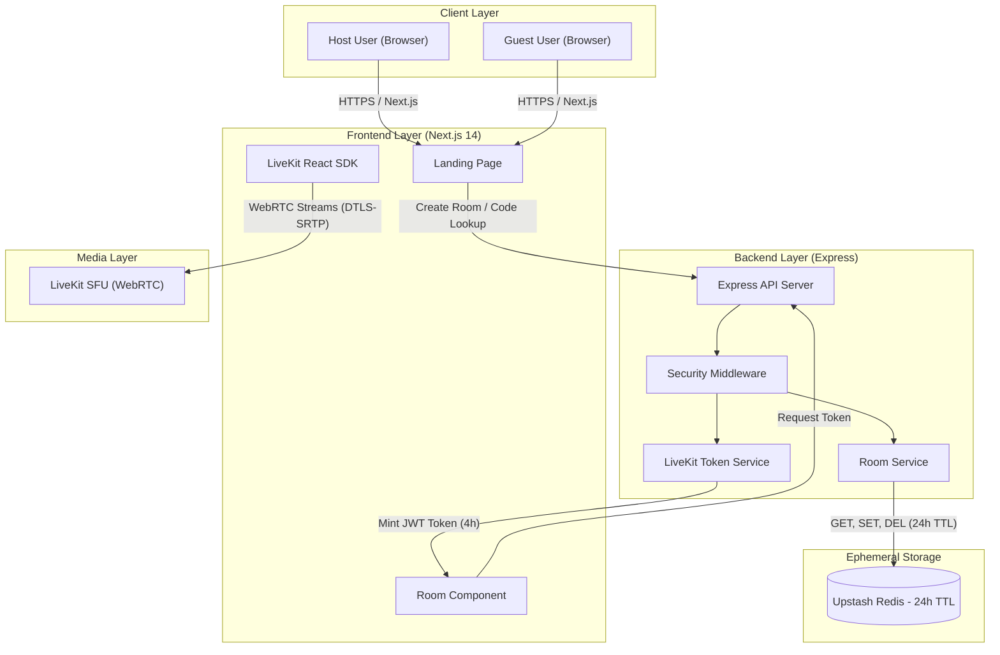
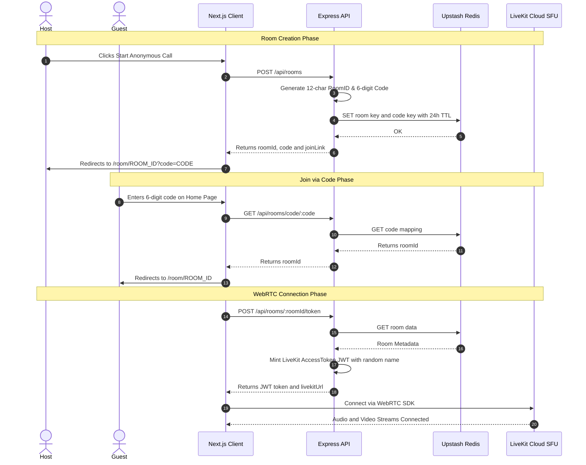

# 👻 Ghost Call — Anonymous & Private Video Calling Platform

> **A product of KKTechSolution by Krishna**  
> High-performance, zero-registration, browser-based video calling platform featuring 6-digit room codes, WebRTC SFU media routing, and 24-hour key expiration.

[](https://nextjs.org/)
[](https://livekit.io/)
[](https://upstash.com/)
[](https://expressjs.com/)
[](LICENSE)

---

## 📐 High-Level Architecture

Ghost Call is designed as an ephemeral, privacy-first distributed video communication system. It separates **signaling & metadata control** (Express + Upstash Redis) from **real-time media streaming** (LiveKit Cloud SFU WebRTC).



---

## 🔄 End-to-End Sequence Flow

### 1. Room Creation & Joining Flow



---

## 🏛️ System Component Breakdown

### 1. **Client Layer (`/client`)**
- **Framework**: Next.js 14 (App Router) + React 18 + Tailwind CSS v4.
- **Landing Page (`/app/page.tsx`)**: High-converting interface for instant 1-click room creation or 6-digit code entry.
- **Room Interface (`/app/room/[roomId]/page.tsx`)**: Manages call state (`loading`, `lobby`, `in-call`, `ended`, `error`).
- **Media Engine Components**: Built using `@livekit/components-react` providing custom video grid layout, active speaker detection, audio meters, camera/mic toggle, screen share, and room invite modals.

### 2. **Backend API (`/backend`)**
- **Runtime**: Node.js + Express.js.
- **Security & Logging**: `helmet` header hardening, `cors` domain restriction, `express-rate-limit` (200 req / 15 mins per IP), reverse-proxy trust (`trust proxy 1`), and clean terminal request logging with IP tracking.
- **Token Minting Service (`livekitService.js`)**: Mints short-lived (4-hour) LiveKit JWT tokens with cryptographically generated anonymous pseudonyms (e.g. *"Bold Eagle"*, *"Quick Lynx"*).
- **Room Management Service (`roomService.js`)**: Handles atomic CRUD operations on Upstash Redis with enforced 24-hour key expiration.

### 3. **Data Layer (Upstash Redis)**
- **Role**: Serverless key-value store for room state and reverse code lookups.
- **Keys Schema**:
  - `room:{roomId}` ➔ `JSON { roomId, code, livekitRoomName, createdAt }` *(TTL: 86,400s)*
  - `code:{code}` ➔ `roomId` *(TTL: 86,400s)*
- **Eviction Policy**: Keys automatically expire via strict TTL without requiring background cron jobs or database sweep tasks.

### 4. **Media SFU Layer (LiveKit Cloud)**
- **Architecture**: Selective Forwarding Unit (SFU) providing low-latency peer media distribution.
- **Protocols**: WebRTC over UDP/TCP with fallback to TURN/TLS.
- **Encryption**: End-to-end transport security using DTLS-SRTP for all audio, video, and data channels.

---

## 🛠️ API Reference

### Base URL: `/api/rooms`

| Method | Endpoint | Description | Request Body / Params | Response Example |
| :--- | :--- | :--- | :--- | :--- |
| `POST` | `/` | Create a new room | None | `{ "roomId": "X9K2P4Q8M1N7", "code": "748291", "joinLink": "http://.../room/X9K2P4Q8M1N7" }` |
| `GET` | `/code/:code` | Resolve 6-digit code to Room ID | `code` (string) | `{ "roomId": "X9K2P4Q8M1N7" }` |
| `GET` | `/:roomId` | Check room status & code | `roomId` (string) | `{ "exists": true, "roomId": "X9K2P4Q8M1N7", "code": "748291" }` |
| `POST` | `/:roomId/token` | Mint LiveKit WebRTC JWT token | `roomId` (string) | `{ "token": "eyJhbG...", "identity": "anon-169...", "displayName": "Swift Fox", "livekitUrl": "wss://..." }` |
| `DELETE` | `/:roomId` | Delete room and expire keys | `roomId` (string) | `{ "success": true }` |

---

## ✨ Core Features

- 🔒 **Zero Registration & Zero Logs**: No accounts, passwords, email collection, or persistent message logs.
- 🔢 **6-Digit Join Code System**: Fast & user-friendly room access without requiring complex URLs.
- ⏱️ **Automatic 24-Hour Expiration**: Automatic state cleanup in Redis via 24h TTL policy.
- 🎭 **Anonymous Pseudonyms**: Automatic assignment of fun, random animal identities for participants.
- 🎨 **Modern Light Mode UI**: Loom/Stripe-inspired aesthetic with smooth glassmorphism.
- 📱 **Fully Responsive**: Mobile-first WebRTC experience for iOS, Android, and Desktop browsers.

---

## 🔐 Security & Privacy Specifications

1. **Zero Data Retention**: No video streams or chat logs are recorded or stored on any server or database.
2. **Short-Lived Access Tokens**: LiveKit tokens expire automatically after 4 hours.
3. **Automatic Key Eviction**: Upstash Redis key eviction is governed by strict 24-hour TTLs.
4. **Media Encryption**: WebRTC audio and video packets are encrypted in transit via DTLS-SRTP.
5. **Rate Limiting**: API routes are protected against brute-force attacks via `express-rate-limit`.

---

## 🛠️ Tech Stack & Ecosystem

- **Frontend**: Next.js 14 (App Router), React 18, Tailwind CSS v4, LiveKit Components React (`@livekit/components-react`).
- **Backend**: Node.js, Express.js, `livekit-server-sdk`, `@upstash/redis`, `helmet`, `cors`, `express-rate-limit`.
- **Infrastructure**: LiveKit Cloud (WebRTC SFU), Upstash Redis (Serverless Key-Value Store).

---

## 📁 Repository Structure

```
Ghost-call/
├── backend/                   <-- Express.js API Server
│   ├── src/
│   │   ├── routes/
│   │   │   └── rooms.js       <-- REST Controllers for Room Creation & Token Generation
│   │   ├── services/
│   │   │   ├── livekitService.js  <-- LiveKit Access Token Minting & Pseudonyms
│   │   │   └── roomService.js     <-- Upstash Redis Room & Code Storage
│   │   ├── utils/
│   │   │   └── codeGenerator.js   <-- 6-Digit Code & Room ID Generators
│   │   └── index.js           <-- Express App Configuration & Security Middleware
│   ├── .env.example
│   └── package.json
├── client/                    <-- Next.js 14 App Router Frontend
│   ├── app/
│   │   ├── page.tsx           <-- Landing Page & Join Code Modal
│   │   ├── room/[roomId]/
│   │   │   └── page.tsx       <-- LiveKit Video Call Room Interface
│   │   ├── layout.tsx         <-- Root Layout & Global Styles
│   │   └── globals.css        <-- Tailwind CSS Setup
│   ├── components/
│   │   ├── Navbar.tsx         <-- Header Navigation Component
│   │   ├── ShareModal.tsx     <-- Invite & Code Share Dialog
│   │   └── room/              <-- Custom Call UI, Grid, Controls & Audio Renderers
│   ├── routes.ts              <-- Centralized Client & API Route Definitions
│   └── package.json
└── README.md
```

---

## 🚀 Local Development Setup

### Prerequisites
- Node.js 18+ and `npm` installed.
- Free accounts on [LiveKit Cloud](https://livekit.io/) and [Upstash Redis](https://upstash.com/).

### 1. Clone Repository

```bash
git clone https://github.com/krishna23810/Ghost-call.git
cd Ghost-call
```

### 2. Backend Setup

```bash
cd backend
npm install
```

Create a `.env` file in `backend/`:

```env
PORT=4000
FRONTEND_URL=http://localhost:3000
LIVEKIT_URL=wss://your-project.livekit.cloud
LIVEKIT_API_KEY=your_livekit_api_key
LIVEKIT_API_SECRET=your_livekit_api_secret

UPSTASH_REDIS_REST_URL=https://your-redis.upstash.io
UPSTASH_REDIS_REST_TOKEN=your_upstash_token
```

Start backend development server:

```bash
npm run dev
```

### 3. Frontend Setup

```bash
cd ../client
npm install
```

Create a `.env.local` file in `client/` (if customized):

```env
NEXT_PUBLIC_BACKEND_URL=http://localhost:4000
```

Start frontend development server:

```bash
npm run dev
```

Open **[http://localhost:3000](http://localhost:3000)** in your browser!

---

## 👤 Author & Credits

- **Product**: **KKTechSolution**
- **Lead Developer**: **Krishna** ([@krishna23810](https://github.com/krishna23810))

---

## 📄 License

MIT License. Developed for open-source, zero-friction private communications by **KKTechSolution**.
